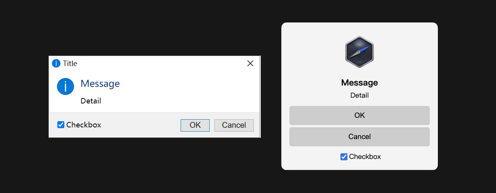

# nwjs-dialog

File dialog and message box for NW.js.



## Open Dialog

Shows an open dialog.

`dialog.showOpenDialog([win, ]options)`

- `win` (optional)
- `options` (optional)
  - `nwdirectorydesc` string (optional) - Dialog title
  - `nwworkingdir` string (optional) - Default path
  - `nwdirectory` boolean (optional) - Select directory
  - `multiple` boolean (optional) - Allow multiple files to be selected
  - `accept` string (optional) - Defines the file types should accept

Returns `Promise<string[]>` - Resolve with an array of file paths chosen by the user.

The `win` argument allows the dialog to attach itself to a parent window, making it modal.

`multiple` and `accept` have no effect when `nwdirectory` is `true`.

```js
const { showOpenDialog } = require("nwjs-dialog");

showOpenDialog().then(([filePath]) => {
  console.log(filePath);
});

showOpenDialog({
  nwdirectorydesc: "Dialog title",
  nwworkingdir: process.cwd(),
  nwdirectory: false,
  multiple: true,
  accept: "audio/*,video/*,image/*,.txt",
}).then((filePaths) => {
  console.log(filePaths);
});
```

## Save Dialog

Shows a open dialog.

`dialog.showOpenDialog([win, ]options)`

- `win` (optional)
- `options` (optional)
  - `nwworkingdir` string (optional) - Default path
  - `nwsaveas` string (optional) - Default filename for saving
  - `accept` string (optional) - Defines the file types should accept

Returns `Promise<string[]>` - Resolve with an array of file paths chosen by the user.

The `win` argument allows the dialog to attach itself to a parent window, making it modal.

When `nwsaveas` is omitted, the filename defaults to empty.

```js
const fs = require("fs");
const { showSaveDialog } = require("nwjs-dialog");

showSaveDialog().then(([filePath]) => {
  fs.writeFileSync(filePath, "Hello");
});

showSaveDialog({
  nwworkingdir: process.cwd(),
  nwsaveas: "1.txt",
  accept: "audio/*,video/*,image/*,.txt",
}).then(([filePath]) => {
  fs.writeFileSync(filePath, "Hello");
});
```

## Message Box

Shows a message box.

The first call will create a MessageBox directory in the working directory to store temporary html files and icon files.

```js
const { showMessageBox } = require("nwjs-dialog");
showMessageBox({ message: "Message" });
showMessageBox({ message: "Something is wrong", type: "error" });
```

`dialog.showOpenDialog([win, ]options)`

- `win` (optional) - If `title` option is omitted, it will be the win's title.
- `options`
  - `message` string - Content of the message box
  - `type` string (optional) - Can be "none", "info", "error", "question", "warning" or "success"
  - `buttons` string[] (optional) - Array of texts for buttons
  - `title` string (optional) - Title of the message box
  - `detail` string (optional) - Extra information of the message
  - `checkboxLabel` string (optional) - If provided, the message box will include a checkbox with the given label
  - `checkboxChecked` boolean (optional) - Initial checked state of the checkbox. `false` by default
  - `icon` string (optional) - Custom icon
  - `id` string (optional) - Message box window id
  - `platform` string (optional) - Message box style. "default", "win32" or "darwin". Follow the os by `default`
  - `customStyle` string (optional) - Custom style for message box elements
  - `inputOptions` object (optional) - User input options
  - `onLoad` function `(win) => void` (optional) - Called when the message box was loaded.
  - `onClose` function `(returnValue, win) => Promise<boolean|void>` (optional) - Called before the message box closes, return `false` will prevents the window close.
  - `onValidate` function `(errors) => void` (optional) - Called after input option validate, contains all input options errors, if everything is correct, it will be an empty array.

Returns `Promise<MessageBoxReturnValue>` - Resolve with an object containing the following:

- `button` number - The index of the clicked button. `-1` if close button clicked.
- `checkboxChecked` boolean - The checked state of the checkbox if `checkboxLabel` was set.
- `inputData` object - Data of the `inputOptions`
  - `radios` number - The index of the checked radio of the `inputOptions.radios`
  - `checkboxes` boolean[] - The checked states of the `inputOptions.checkboxes`
  - `inputs` string[] - The values of the `inputOptions.inputs`

```js
const { showMessageBox } = require("nwjs-dialog");
showMessageBox({
  message: "Message",
  type: "info",
  buttons: ["OK", "Cancel"],
  title: "Title",
  detail: "Detail",
  checkboxLabel: "Checkbox",
  checkboxChecked: true,
  icon: "",
  platform: "default",
  customStyle: ".win32 .button:first-child { border-color: #0078d7; }",
}).then(({ button, checkboxChecked }) => {
  console.log(button);
  console.log(checkboxChecked);
});
```

### Custom Style

Main elements's class names:

<!-- prettier-ignore -->
```css
/* .header */
.header-icon {}
.title {}
/* .body */
.body-icon {}
.message {}
.detail {}
/* .input-options */
.checkbox-label {}
.checkbox-input {}
.radio-label {}
.radio-input {}
.input-label {}
.input-input {}
.description {}
/* .footer */
.button {}
/* platforms */
.win32 * {}
.darwin * {}
/* types */
.none {}
.info {}
.question {}
.warning {}
.error {}
.success {}
```

### Input Options

You can add simple input options.

`inputOptions` object (optional) - User input options

- `radios` object[] (optional)
  - `label` string (optional) - Text for the item's label.
  - `value` boolean (optional) - Default value for the item.
  - `description` string (optional) - Description for the item.
- `checkboxes` object[] (optional)
  - `label` string (optional) - Text for the item's label.
  - `value` boolean (optional) - Default value for the item.
  - `description` string (optional) - Description for the item.
  - `required` boolean (optional) - Whether the checkbox must be checked.
- `inputs` object[] (optional)
  - `label` string (optional) - Text for the item's label.
  - `value` string (optional) - Default value for the item.
  - `description` string (optional) - Description for the item.
  - `placeholder` string (optional) - Placeholder for input.
  - `password` string (optional) - Set to password input.
  - `required` boolean (optional) - Whether the input is required.
  - `rule` RegExp | `(value: string) => boolean` (optional) - Validation rule for the input. e.g. `/^\d+$/`

**NOTE**

If the message box was opened through another window, the resolve handler will be lost when the window is closed.

So if you need to do some important processing on user input, you should open the message window in bg-script.

```js
const { showMessageBox } = require("nwjs-dialog");
showMessageBox({
  title: "Input Options",
  inputOptions: {
    radios: [
      { label: "Radio 1" },
      { label: "Radio 2", value: true, description: "Description" },
    ],
    checkboxes: [
      { label: "Checkbox 1", description: "Description" },
      { label: "Checkbox 2", value: true },
    ],
    inputs: [
      {
        label: "Input 1",
        placeholder: "Placeholder",
        description: "Description",
      },
      {
        label: "Input 2",
        value: "123456",
        password: true,
        description: "Password Input",
      },
    ],
  },
}).then(({ button, inputData }) => {
  if (button === 0) {
    const { radios, checkboxes, inputs } = inputData;
    console.log({ radios, checkboxes, inputs });
  }
});
```

#### `inputOptions` validators

```js
const { showMessageBox } = require("nwjs-dialog");
showMessageBox({
  title: "Simple Inputs Validators",
  inputOptions: {
    checkboxes: [
      { label: "Checkbox", required: true, description: "Required" },
    ],
    inputs: [
      { label: "Input 1", value: "", required: true, description: "Required" },
      {
        label: "Input 2",
        value: "abc",
        rule: /^[0-9]+$/,
        description: "A RegExp rule. This input can only have numbers.",
      },
      {
        label: "Input 2",
        value: "Value",
        rule: (value) => value === "ssnangua",
        description: "A function rule. This input must be `ssnangua`.",
      },
    ],
  },
  // Called after input option validate, contains all input options errors, if everything is correct, it will be an empty array.
  onValidate(errors, win) {
    win.window.document
      .querySelector(".button:first-child")
      .classList[errors.length > 0 ? "add" : "remove"]("disabled");
  },
});
```

#### Example: Login Window

Here is a simple login window example:

```js
const { showMessageBox } = require("nwjs-dialog");
const customStyle = `.message {
  margin: 0 auto;
}
.button {
  border: 1px solid #dcdfe6;
  border-radius: 4px;
  padding: 2px 8px;
}
.darwin .button {
  padding: 4px 8px;
}
.button:first-child {
  background: #409eff;
  color: #fff;
}
.button:first-child:hover {
  background: #66b1ff;
}
.button:last-child {
  background: #fff;
  border-color: #dcdfe6;
}
.button:last-child:hover {
  background: #ecf5ff;
  border-color: #c6e2ff;
  color: #409eff;
}`;
showMessageBox({
  id: "loginWin",
  message: "Awesome Web App",
  type: "none",
  buttons: ["Login", "Cancel"],
  title: "Login",
  checkboxLabel: 'Agree to the <a href="#" target="_blank">User Agreement</a>.',
  checkboxChecked: true,
  icon: "./images/user.png",
  customStyle,
  inputOptions: {
    inputs: [
      { label: "User", placeholder: "Nickname / Email" },
      { label: "Password", value: "", password: true },
    ],
    checkboxes: [{ label: "Remenber me" }],
  },
  onClose({ button, checkboxChecked, inputData }, win) {
    if (button === 0) {
      const [user, password] = inputData.inputs;
      if (!user || !password) {
        win.window.alert("User and password cannot be empty.");
        // You can modify the elements of message box, too.
        // win.window.document.querySelector(".message").style.color = "red";
        return false;
      } else if (!checkboxChecked) {
        win.window.alert("You need to agree to the User Agreement.");
      } else {
        // Can return a promise and you can send network requests to validate the data
        return new Promise((resolve) => {
          setTimeout(() => {
            if (user !== "ssnangua") {
              win.window.alert("Incorrect user or password.");
              resolve(false);
            }
            resolve(true);
          }, 1000);
        });
      }
    }
  },
}).then(({ button, inputData }) => {
  if (button === 0) {
    const [user, password] = inputData.inputs;
    const [remenberMe] = inputData.checkboxes;
    console.log(user, password, remenberMe);
  }
});
```
